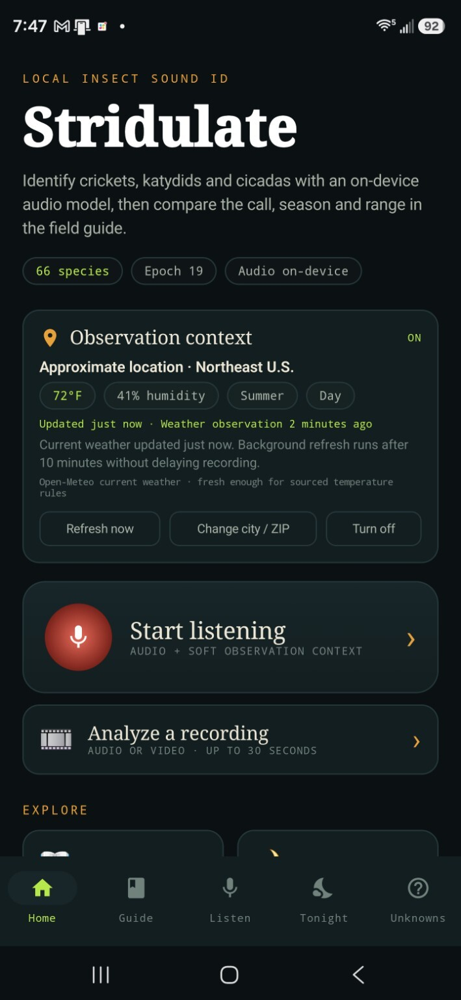
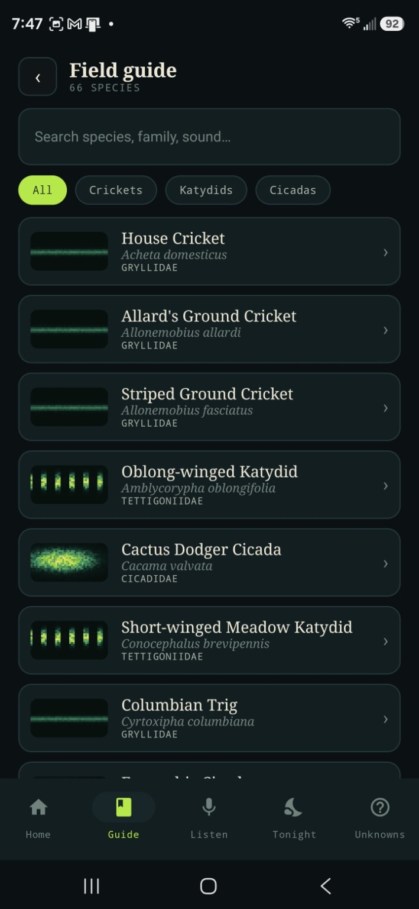
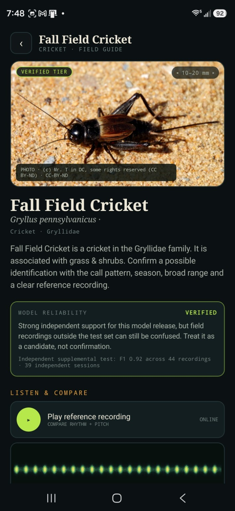
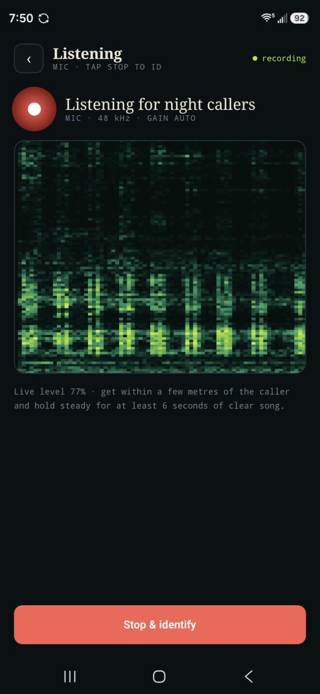
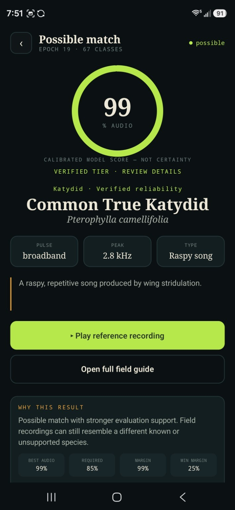

# Stridulate

> **Work in progress / research build.** Stridulate is an offline-first Android singing-insect identifier. The final Stage-J detector is strong for a single dominant supported caller, but it is not yet a reliable simultaneous multi-insect separator.

**Private, on-device insect sound identification for Android.**

Stridulate v0.3 uses the frozen **Stage J.1 / Perch 2.0** pipeline for 88 supported acoustic classes. The app analyzes microphone recordings and imported audio locally, shows calibrated evidence and Top 3 candidates, links results directly into the field guide, and keeps unresolved recordings in a private local **Unknowns** archive.

## Current model

The v0.3 production research detector is frozen Stage J.1:

- Perch 2.0 ONNX waveform encoder
- 32 kHz mono, five-second model windows
- 1,536-value global embedding
- frozen 88-class Stage-D affine head
- frozen J.1 per-species calibration and acceptance thresholds
- long-recording persistence policy retained from J.1

Controlled Stage-J validation produced approximately:

- **94.77%** exact single-insect identification
- **60.00%** negative/background rejection
- **4.35%** pair all-true recovery
- **15.52%** quiet-insect recall

These are controlled research-validation measurements, not a claim of 94.77% accuracy on arbitrary wild phone recordings. Stage J showed that Perch contains useful latent multi-source information but cannot safely decide simultaneous callers by itself. True source localization/separation is deferred to **Stage K**.

## Screenshots

<p align="center">
  
  
  
</p>
<p align="center">
  
  
</p>

## Highlights

- Runs inference locally on Android.
- Supports **88 frozen J.1 acoustic classes**.
- Uses the exact frozen Perch model, affine head and J.1 calibration contract.
- Displays **High confidence**, **Likely match**, or **No confident match** instead of implying certainty.
- Shows the Top 3 supported candidates.
- Makes the primary result and Top 3 directly tappable into the exact field-guide entry.
- Returning from the guide preserves the result page and scroll position.
- Includes a **Sound sensitivity** slider that is **OFF by default**. It boosts analysis/spectrogram amplitude for quiet callers without altering the saved raw WAV.
- Saves recordings and accepted live detections in the persistent **Log**.
- Keeps unresolved or manually selected recordings in **Unknowns**.
- Lets a saved Unknown be **re-analyzed with frozen J.1** without overwriting the original WAV, notes, or linked iNaturalist observation.
- Supports optional broad location, season, day/night and current-weather context as bounded reranking support.
- Provides taxon-matched iNaturalist community recordings for comparison.
- Can share an original WAV to iNaturalist and link the resulting public observation for later review.
- Keeps human review between community identification and any training contribution.

## Result wording

### High confidence

The frozen J.1 species threshold is passed by a conservative margin on a good-quality recording. This is still an identification aid; compare the call and field-guide information before treating it as confirmed.

### Likely match

The species passed its frozen J.1 calibrated acceptance threshold, but the result is not in the stricter high-evidence band.

### No confident match

No supported species passed the active J.1 evidence gate, or a critical recording-quality check failed. The closest candidates can still be useful leads but are not presented as an identification.

## Sound sensitivity

The listening screen includes a 0–100% sensitivity control:

- **0% / OFF:** neutral 1.0× analysis gain
- higher settings: progressively increase analysis gain up to 4.0×
- the live spectrogram reflects the same analysis gain
- imported files use the same analysis setting
- the original microphone WAV remains unchanged

This is intended for quiet callers. Increasing sensitivity can also amplify noise, so it should not be treated as extra model confidence.

## Unknowns and re-analysis

A saved Unknown retains the original WAV and review metadata. From the saved-recording screen, **Re-analyze with frozen J.1** runs that WAV through the current 88-species detector using audio only. The existing Unknown record is not replaced, and its private notes and linked iNaturalist observation remain intact.

This is useful for recordings saved under older Stridulate builds: they can be revisited with the final Stage-J detector without exporting and re-importing files.

## Observation context

Observation context remains optional. When enabled, Stridulate can use:

- approximate location or manually entered U.S. city/ZIP
- broad region
- current month/season
- true local day/night status when available
- current outdoor temperature and humidity from Open-Meteo

Context is secondary to the audio model. It can gently reorder close candidates but does not rewrite the displayed J.1 evidence score or hard-exclude a species.

Imported recordings default to audio-only analysis because the phone's current weather/location may not describe when or where the recording was made.

## Field guide coverage

All 88 frozen J.1 labels are navigable from model results. Existing hand-authored field-guide entries retain their detailed content. For newly supported labels that do not yet have a full hand-authored entry, v0.3 generates a conservative placeholder entry rather than inventing detailed range, season, or frequency claims.

Those placeholders can be enriched independently of the frozen model.

## Runtime model delivery

The large frozen runtime binaries are intentionally **not committed to GitHub and are not packed into the APK**:

- `perch_v2_no_dft.onnx`
- `j1_stage_d_affine.bin`
- `j1_calibration.json`

The Windows build/install helper verifies exact SHA-256 hashes and stages all three into Stridulate's private `files/models` directory after an in-place APK install. The app verifies them again before allowing inference.

The source checkout contains the frozen 88-label order and exact runtime hashes. This keeps the repository/APK smaller while preserving an auditable model contract.

## Preserving saved recordings

Stridulate keeps the application ID:

```text
com.pgotta.stridulate
```

For an existing test phone, **do not uninstall Stridulate and do not clear app data**. The recommended Windows helper builds locally and uses `adb install -r`, so it attempts an in-place update with the same local debug signing identity. If Android reports a signing mismatch, the helper stops rather than uninstalling the existing app.

See [BUILD.md](BUILD.md).

## Privacy

- Classification audio stays on-device.
- Raw recordings are not uploaded for inference.
- Sound sensitivity does not alter saved evidence WAVs.
- Observation context is optional.
- Approximate location/weather state is locally cached.
- Unknown WAVs remain local unless the user explicitly shares or exports them.
- iNaturalist sharing uses Android's share sheet; Stridulate does not collect an iNaturalist password.

## Community identification loop

Unknown recordings can be shared to iNaturalist for human identification. Stridulate can then store the public observation ID and check the latest public community taxon. Community consensus is treated as evidence, not automatic training ground truth.

A contributor must still listen, review the label, confirm rights, and explicitly approve an original local WAV before exporting a contribution bundle.

See [COMMUNITY_IDENTIFICATION.md](COMMUNITY_IDENTIFICATION.md).

## Build and verification

The repository's GitHub Actions workflow performs source-contract verification, compiles a debug APK, verifies the APK asset contract, and uploads the debug APK as a CI artifact.

For the existing field-test phone, use the Windows build/install package instead of installing the CI APK, because the local helper preserves the local debug signing identity and stages the frozen private runtime files without clearing app data.

See [BUILD.md](BUILD.md) and [docs/FINAL_J_ANDROID.md](docs/FINAL_J_ANDROID.md).

## Stage K

Stage J is closed. No J.8/J.9/J.10 sequence is planned.

The next research stage is **Stage K**, a separate multi-source localization/separation architecture. Its job will be to find distinct acoustic objects first and then use the strong frozen J.1/Perch detector as a downstream species recognizer where appropriate.

Until Stage K proves otherwise, v0.3 should be treated as a **dominant-caller identifier**, not a Merlin-style simultaneous chorus separator.
